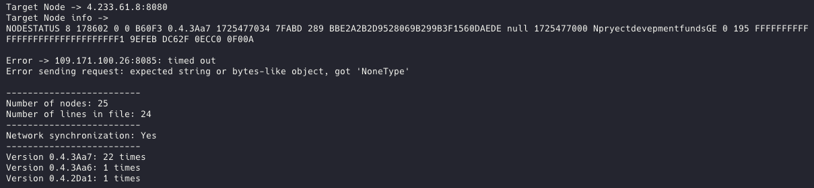

# NosoScan_Py
A utility that scans the network for synchronization and versions of nodes in the network.

```
python3 scan.py # Install the mail node in the scan.py file
# or
python3 scan.py --ip 192.168.0.1 --port 9090
```


